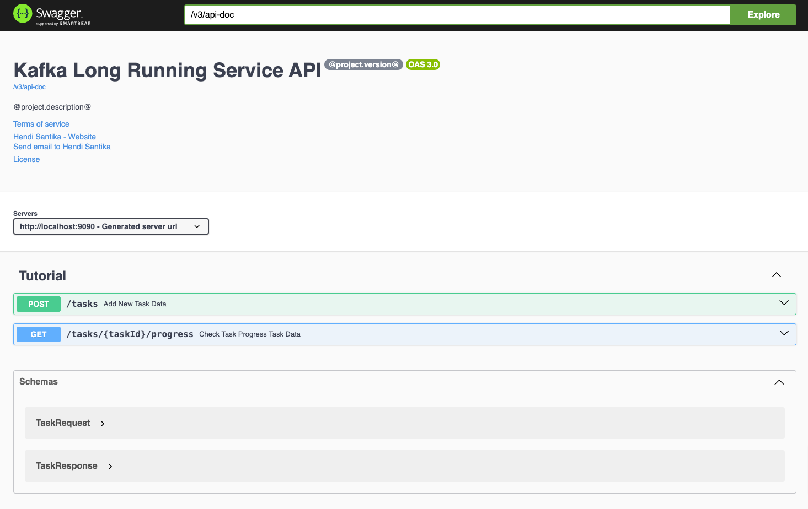

# spring-boot-kafka-long-running-tasks

### Things todo list

1. Clone this repository: `git clone https://github.com/hendisantika/spring-boot-kafka-long-running-tasks.git`
2. Navigate to the folder: `cd spring-boot-kafka-long-running-tasks`
3. Run the application: `mvn clean spring-boot:run`
4. Open your favorite browser: http://localhost:9090/swagger-ui

### Image Screenshot

Swagger UI

